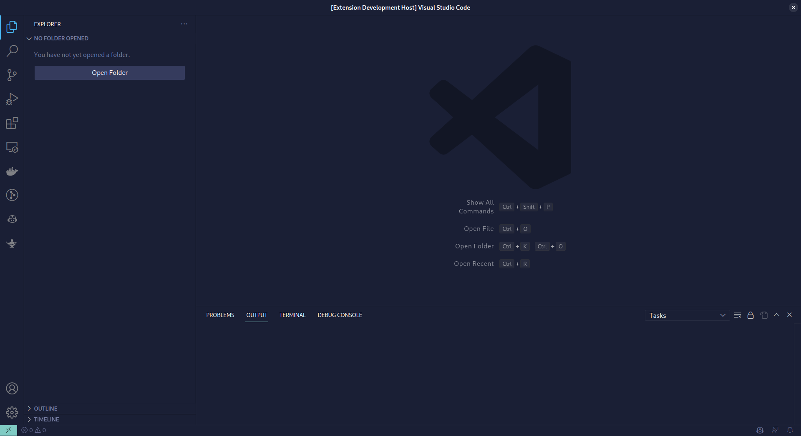

# Mica Blue Dark - Visual Studio Code Theme

## Description

Mica Blue Dark is a Visual Studio Code theme inspired by Windows 11's mica effect with a blue background in dark mode.

## Installation

1. Clone the repo to `~/.vscode/extensions`` or `C:\Users\username\.vscode\extensions` using the command `git clone https://github.com/sidevesh/vscode-mica-blue-dark-theme.git ~/.vscode/extensions/sidevesh.mica-blue-dark-theme-0.0.1`
4. Activate the theme by going to `View -> Command Palette` or using the shortcut `Ctrl+Shift+P`, then type `Preferences: Color Theme` and choose "Mica Blue Dark"

## Screenshots

    

## Features

- Dark mode theme with a blue background
- Smooth mica effect inspired by Windows 11
- Consistent and readable syntax highlighting
- Carefully selected colors to reduce eye strain

## Contributing

Contributions are welcome! If you encounter any issues or have suggestions for improvements, please open an issue on the [GitHub repository](https://github.com/sidevesh/vscode-mica-blue-dark-theme).
